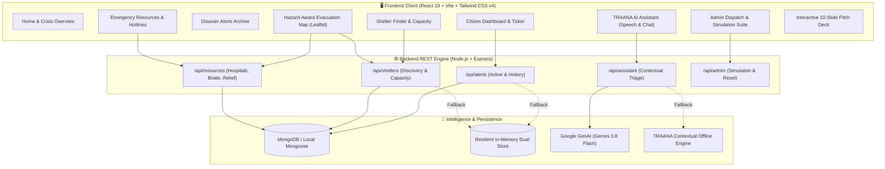
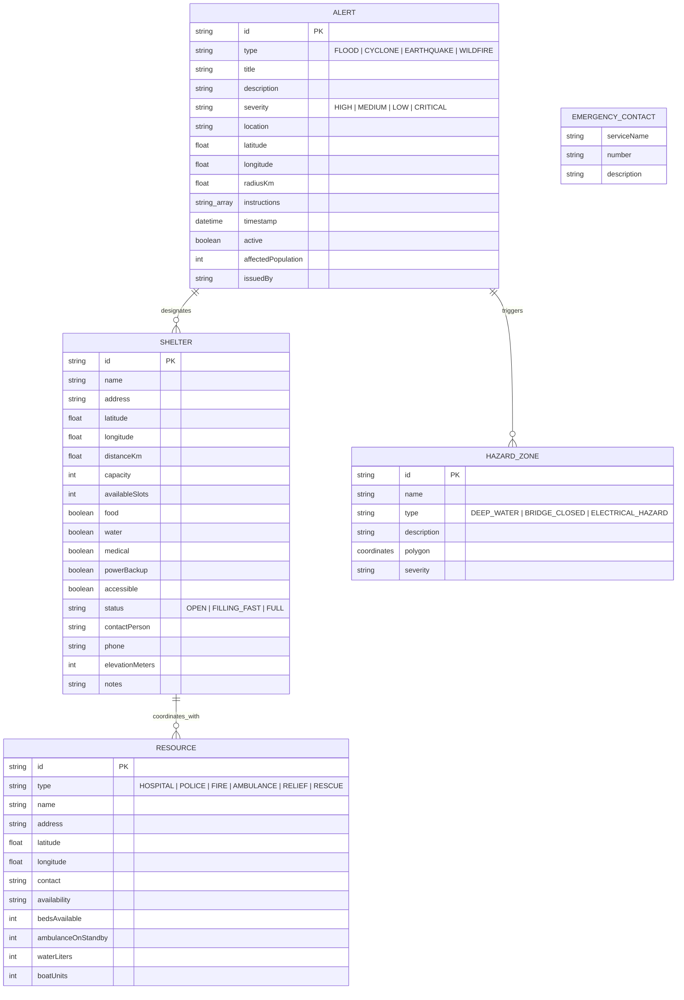
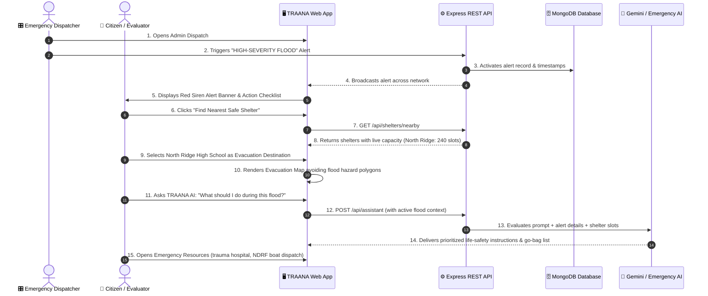

# TRAANA — Threat Response & Assistance Network for Alerts and Navigation

> **Disaster-Alert & Emergency-Response Minimum Viable Product (MVP)**  
> **Core Mission Flow:** `Alert → Understand → Act → Find Shelter → Evacuate → Get Help`

[](https://render.com/deploy?repo=https://github.com/Swas00/traana-mvp)

---

## 📌 Executive Summary

**TRAANA** bridges the critical gap between early disaster warnings and citizen survival. Traditional emergency broadcasts state that danger is incoming, but leave citizens stranded in confusion. TRAANA delivers an end-to-end, life-safety navigation network:
1. **Disaster Alerts:** Instant notifications with high-visibility severity ratings (HIGH, MEDIUM, LOW) and immediate action instructions.
2. **Citizen Dashboard:** Actionable life-safety steps (cutting electricity breakers, turning off gas, grabbing 72h go-bags).
3. **Shelter Discovery:** Real-time occupancy tracking, bed availability, high-ground elevation metrics, and critical facility filters (wheelchair ramps, medical stations, hot meals, drinking water).
4. **Hazard-Aware Evacuation Map:** Live OpenStreetMap cartography plotting safe detour paths around inundated lowlands, submerged bridges, and electrocution zones.
5. **TRAANA AI Assistant:** Natural-language disaster triage with situational awareness of the active alert, answering urgent questions with life-saving precision.
6. **Emergency & Relief Directory:** Direct dispatch dial links for universal SOS (112), Disaster Cell (1070), trauma hospitals, NDRF rescue boat squads, and fire teams.
7. **Crisis Admin Dispatcher:** Complete simulation command suite for reviewers to trigger flash floods, cyclones, or wildfires live, update shelter bed counts, and see citizen dashboards update instantly.

---

## 🏛️ System Architecture



---

## 🗄️ Database & Entity-Relationship (ER) Diagram



---

## 🔄 Core Demonstration Flow (Section 9 Walkthrough)



---

## 📡 REST API Documentation

### 1. Alerts Module
| Method | Endpoint | Description | Sample Response Payload |
|---|---|---|---|
| `GET` | `/api/alerts` | List all historical and current alerts | `{ success: true, count: 3, data: [...] }` |
| `GET` | `/api/alerts/active` | Get currently active disaster emergency alerts | `{ success: true, count: 1, data: [{ type: "FLOOD", severity: "HIGH", ... }] }` |
| `GET` | `/api/alerts/:id` | Fetch specific alert record | `{ success: true, data: { ... } }` |
| `POST` | `/api/alerts` | Create and broadcast new simulated alert | `Body: { title, type, severity, location, radiusKm, instructions: [] }` |
| `PATCH` | `/api/alerts/:id/toggle` | Toggle alert between active and archived | `Body: { active: true / false }` |

### 2. Shelters Module
| Method | Endpoint | Description | Sample Query / Body |
|---|---|---|---|
| `GET` | `/api/shelters` | List all registered shelters sorted by distance | — |
| `GET` | `/api/shelters/nearby` | Filter shelters by accessibility, distance, and facilities | `?accessible=true&food=true&medical=true` |
| `GET` | `/api/shelters/:id` | Fetch detailed shelter record | — |
| `PATCH` | `/api/shelters/:id/capacity` | Update available bed slots (simulates shelter filling up) | `Body: { availableSlots: 0 }` |

### 3. Resources & Hazards Module
| Method | Endpoint | Description |
|---|---|---|
| `GET` | `/api/resources` | List all emergency resources (optional `?type=HOSPITAL`) |
| `GET` | `/api/resources/hospitals` | Filter exclusively for trauma centers and ICU facilities |
| `GET` | `/api/resources/relief` | Filter for clean drinking water and food ration relief centers |
| `GET` | `/api/resources/contacts` | Fetch emergency dispatch hotlines (112, 1070, 108, 101, 100) |
| `GET` | `/api/resources/hazards` | Retrieve active hazard avoidance polygons for map routing |
| `GET` | `/api/resources/citizen-location` | Get simulated citizen coordinates |

### 4. AI Assistant Module
| Method | Endpoint | Description | Sample Request |
|---|---|---|---|
| `POST` | `/api/assistant` | Context-aware natural-language emergency triage | `Body: { question: "What should I pack?", activeAlertId: "alert-001" }` |

### 5. Admin & Simulation Module
| Method | Endpoint | Description |
|---|---|---|
| `POST` | `/api/admin/trigger-flood` | 1-Click trigger for the Core Demo High-Severity Flood emergency |
| `POST` | `/api/admin/reset-demo` | Resets all alerts, shelter capacities, and resources to seed baseline |
| `POST` | `/api/admin/preset-simulation` | Trigger scenario presets: `CYCLONE_WARNING`, `WILDFIRE`, `EARTHQUAKE_AFTERSHOCK` |
| `GET` | `/api/admin/status` | Real-time database telemetry, active alert counts, and occupancy |

---

## 💻 Technology Stack

- **Frontend:** React 19, Vite 8, Tailwind CSS v4, Lucide React Iconography, Leaflet Cartography.
- **Audio Synthesizer:** Native Web Audio API emergency siren oscillator wail (100% offline, zero external audio asset dependency).
- **Speech Synthesis:** Web Speech API for emergency broadcast read-aloud and accessibility.
- **Backend:** Node.js, Express.js REST API with CORS and structured routing.
- **Database:** MongoDB with Mongoose document schemas + Automatic Dual In-Memory Failover Cache (ensures uninterrupted operation even during internet/database disconnects).
- **AI Engine:** Google GenAI SDK (`@google/genai`) using `gemini-3.8-flash` with contextual situation injection + Built-in offline emergency knowledge core.

---

## 🚀 Running the Prototype Locally

### Prerequisites
- Node.js >= 18 (Tested on v24.17.0)
- npm >= 9 (Tested on 11.13.0)
- MongoDB (Running locally or via cloud URI; if unavailable, in-memory fallback engages automatically)

### 1-Click Windows Launch
Double-click `start.bat` in the project root, or execute:
```powershell
./start.ps1
```

### Manual Launch
**Backend:**
```bash
cd backend
npm install
npm start
# Runs on http://localhost:5000
```

**Frontend:**
```bash
cd frontend
npm install
npm run dev
# Runs on http://localhost:3000
```

---

## 📋 Evaluation & Testing Checklist (Section 11)

- [x] **Frontend loads without console errors** (Verified via Vite build & runtime).
- [x] **All navigation routes work** (Home, Dashboard, Alerts, Shelters, Routes, Assistant, Resources, Admin).
- [x] **Admin can create and activate an alert** (Tested via custom alert creator and simulation presets).
- [x] **Active alert appears on citizen dashboard** (Immediate broadcast banner, high-severity badge, and instructions).
- [x] **Alert details display correctly** (Timestamps, affected sectors, casualty estimates, issuing authority).
- [x] **Shelter data loads from API** (Verified live MongoDB and REST API endpoints).
- [x] **Available shelter capacity is shown correctly** (Live capacity progress bars, occupancy percentages).
- [x] **Map loads and displays markers** (Citizen pin, shelter markers, destination highlight).
- [x] **Hazard avoidance active** (Polygons drawn for flooded lowlands, detour route plotted).
- [x] **TRAANA AI returns concise answers** (Active-alert context injected, go-bag checklists, tap water safety).
- [x] **Emergency audio alert siren works** (Web Audio API modulated frequency synthesizer).
- [x] **Multilingual switcher ready** (English, Hindi, Spanish).
- [x] **High contrast emergency mode** (Optimized for visibility under glare or night-time disaster conditions).
- [x] **Interactive 10-Slide Pitch Deck** (Embedded directly into the application header for live presentation).
